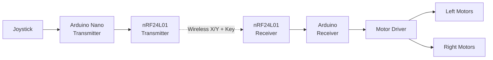

# Wireless RC Car

An Arduino-based wireless RC car controlled using an nRF24L01 radio communication system. The project uses joystick input, wireless data transmission, differential motor control, and a communication-loss fail-safe.

## Project Overview

This project is a remotely controlled four-wheel RC car developed using Arduino and nRF24L01 wireless transceivers.

A joystick connected to the transmitter Arduino provides X and Y-axis input. These values are transmitted wirelessly to the receiver mounted on the RC car. The receiver interprets the input and controls the motors to achieve forward, backward, left, right, and diagonal movement.

The receiver also validates incoming commands and includes a fail-safe that stops the motors when communication is lost.

## Project Demonstration


## Controller

The transmitter consists of an Arduino Nano, nRF24L01 wireless transceiver, and joystick module.


## System Architecture



### Data Flow

1. The joystick generates X and Y analog values.
2. The transmitter Arduino reads the joystick values.
3. The transmitter packages the values with a command key.
4. The nRF24L01 transmitter sends the data wirelessly.
5. The receiver nRF24L01 receives the data.
6. The receiver validates the command key.
7. The receiver converts the joystick input into motor commands.
8. PWM signals are used to control motor speed.
9. If the wireless signal is lost for more than 500 ms, the receiver stops the motors.

## Features

- Wireless RC control using nRF24L01
- Joystick-based X/Y control
- Forward and backward movement
- Left and right turning
- Forward-left and forward-right movement
- Backward-left and backward-right movement
- PWM-based motor speed control
- Joystick dead-zone handling
- Basic command validation
- Communication-loss fail-safe
- Serial monitoring for debugging

## Hardware

### Transmitter

- Arduino Nano
- nRF24L01 wireless transceiver
- Joystick module

### Receiver

- Arduino-compatible microcontroller
- nRF24L01 wireless transceiver
- Motor driver
- DC motors
- RC car chassis
- Battery / power supply

## Software

- Arduino C/C++
- SPI communication
- RF24 library

## Repository Structure

```text
wireless-rc-car/
│
├── README.md
│
├── receiver/
│   └── receiver.ino
│
├── transmitter/
│   └── transmitter.ino
│
└── images/
    ├── controller.jpg
    └── rc-cars-testing.jpg
```

## Transmitter

The transmitter reads the joystick's X and Y values through analog inputs and sends them wirelessly using the nRF24L01 module.

The transmitter sends a data structure containing:

```cpp
struct Data {
  int x;
  int y;
  int key;
};
```

Transmission status is also monitored through the Serial Monitor.

## Receiver

The receiver listens for incoming data from the transmitter and processes the joystick values.

The receiver supports:

- Forward
- Backward
- Left
- Right
- Forward-left
- Forward-right
- Backward-left
- Backward-right
- Stop

Different PWM values are applied to the left and right motors to achieve diagonal movement.

## Fail-Safe

The receiver tracks the time since the last valid wireless packet.

If no signal is received for more than 500 ms, the receiver automatically stops the motors.

This prevents the vehicle from continuing to move if communication with the controller is interrupted.

## Communication

The project uses the RF24 library to communicate between the two nRF24L01 modules.

```text
Controller
    │
    │ X, Y, Key
    ▼
nRF24L01 Transmitter
    )))))))))) wireless ((((((((((
nRF24L01 Receiver
    │
    ▼
Motor Control
```

## Future Improvements

- Add detailed circuit diagrams
- Improve speed control and tuning
- Add battery monitoring
- Add additional control modes
- Improve the transmitter enclosure
- Add more detailed hardware documentation
